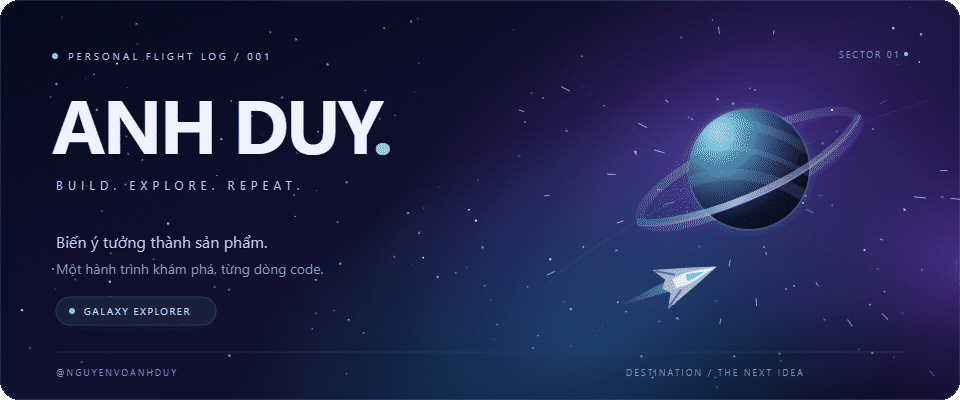

  

  <strong>Xin chào, mình là Anh Duy.</strong> 
  Mình xây dựng các dự án web và khám phá cách đưa AI vào những trải nghiệm hữu ích.

  <a href="#-trạm-công-nghệ">Công nghệ</a> ·
  <a href="#-những-chuyến-bay">Dự án</a> ·
  <a href="https://github.com/nguyenvoanhduy?tab=repositories">Khám phá các repo</a>

---

### 🛰️ Trạm công nghệ

Những công nghệ mình sử dụng trong các dự án:

| Giao diện | Backend | Dữ liệu & công cụ |
| :--- | :--- | :--- |
| React · Next.js | Node.js · NestJS · Express | PostgreSQL · MySQL |
| TypeScript · JavaScript | REST API · JWT | Docker · Git |
| Tailwind CSS · Material UI | Tích hợp Gemini AI | Redis · Kafka |

### 🚀 Những chuyến bay

| Dự án | Mình đang xây dựng gì? | Công nghệ |
| :--- | :--- | :--- |
| **[Balii E-commerce](https://github.com/nguyenvoanhduy/Balii-ecommerce-platform)** | Đồ án thương mại điện tử với giao diện mua sắm, quản trị và kiến trúc backend microservices đang được phát triển. | Next.js · NestJS · PostgreSQL · Docker |
| **[ChatBoxAI](https://github.com/nguyenvoanhduy/ChatBoxAI)** | Dự án trợ lý AI hỗ trợ sinh viên tra cứu thông tin và hỏi đáp về học tập. | React · Express · MySQL · Gemini |
| **[QR Code Generator](https://github.com/nguyenvoanhduy/qr-code-generator)** | Công cụ tạo mã QR trên nền web. | HTML · JavaScript |

### 🌌 Nhật ký hành trình

- **Xây dựng:** các ứng dụng web từ giao diện đến backend.
- **Khám phá:** AI và những cách ứng dụng vào sản phẩm thực tế.
- **Cải thiện:** trải nghiệm người dùng, cấu trúc mã nguồn và tài liệu dự án.

  Mỗi dự án là một chuyến bay. Mỗi dòng code là một bước tiến.

